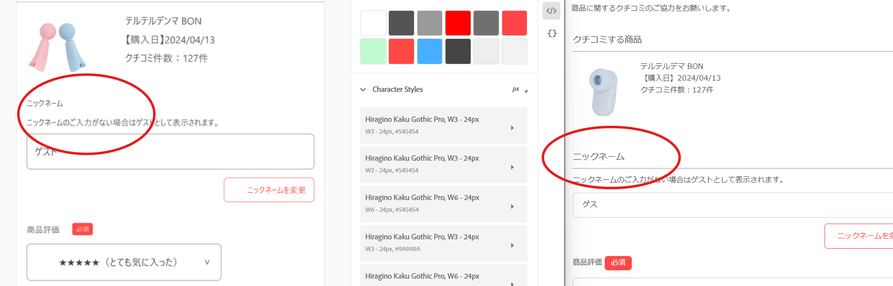

1. Not same with XD file.

1. Use 33 px space between

1. why button is so thin? please check in XD file.

   

1. Design file in ttile is with red color. please change. use <h2> tag for that

   
2. Dropdown is not the same. 
3. Please recheck the size (measurements)

   
4. breadcrumb_area is not the same. 